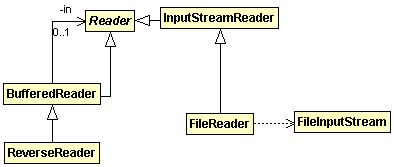

# 裝飾者模式實例 File IO

最著名的裝飾模式應用，應該就是java.io這套讀寫檔案的API了，這邊取出幾個java.io package內的類別，類別圖如下圖所示：
右邊的StringBufferInputStream與FileInputStream就如同冒險者故事的槍兵一樣，是一個可以被裝飾的具體類別。左邊的FilterInputStream則是抽象裝飾者，BufferedInputStream與LineNumberInputStream則是實際的裝飾者類別， 其中BufferedInputStream提供mark跟reset方法，可以讓讀過的檔案再次重讀；LineNumberInputStream可以使用getLineNumber()來取得目前位置的行號。  

這邊我們自己寫一個簡單的裝飾類別UpperCaseInputStream，功能是將檔案內的文字轉為大寫。

  


###程式碼
```
/**
 * 裝飾類別-將讀入的字母轉成大寫
 */
public class UpperCaseInputStream extends FilterInputStream{
	public UpperCaseInputStream(InputStream in) {
		super(in);
	}

	@Override
	public int read() throws IOException {
		int c = super.read();
		return (c == -1) ? c : Character.toUpperCase((char)c) ;
	}
}

/**
 * 裝飾模式實例javaIO-測試
 */
public class JavaIOTest {
	@Test
	public void test() throws IOException{
			// 測試將讀入的字母換成大寫
			InputStream in = new UpperCaseInputStream(new BufferedInputStream(new FileInputStream("test.txt")));
			
			int c;
			// 這是 BufferedInputStream 提供的mark
			in.mark(0);
			while(( c = in.read()) >= 0){
				System.out.print((char)c);
			}
			
			// 這是 BufferedInputStream 提供的reset
			in.reset();
			System.out.println("--------------reset--------------");
			while( (c = in.read()) >= 0){
				System.out.print((char)c);
			}
			in.close();
			
	}
}
```

