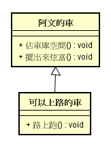

# 物件導向程式設計基本原則 - SOLID

在物件導向程式中，遵循**SOLID**這五項基本原則，可以幫助程式設計師寫出好維護、易擴充的程式架構：
  
### S: Single responsibility principle(SRP) 單一職責  
所謂的RSP是指一個類別只負責一件事情，阿文18歲生日後取得汽車駕照，爸爸買一台車可以在天空上飛、在路上走、在水下游的車給他當生日禮物，是不是很酷的事情?  
可是阿文想開這台車，就必須要有機師職照、汽車駕照、潛水艇駕駛證照才能上路，如果哪天這台車故障了，可能要修飛機的技師、修汽車的技師、修潛艇的技師一起維修查看問題在哪邊才行。  

如果一個類別負擔太多工作，就會像上面的超級汽車一樣，不論是使用上或後續的維護都會造成很大的困擾。
要注意單一職責不是指一個類別裡面只有一個方法，就算只是一台普通的車，也會有前進、後退、左轉、右轉等等基本功能吧!  

不過也要注意功能是不是被切的太細碎造成過度設計(over design)的情況，一台車雖然可以拆成方向盤、大燈、引擎、汽缸等等零件，
每一個零件也都有不同的功能，但對汽車駕駛人來說，只要知道車子怎麼開就夠了，不需要去理解車子內部詳細的構造。
對維修技師來說，了解細部零件的功能反而才是必要的，因此要怎麼規劃個功能，就要視實際的需求而定。  
如何定義一個類別(物件)的責任是一個很抽象也很難釐清的事情，這部分就先到這裡就好。
 
## O: Open/close principle(OCP)  開放/封閉原則 
物件導向程式設計最重要的開放(擴充)封閉(修改)原則。一套軟體應該要能擴充新的功能，但如果這些程式碼耦合度(coupling)過高，
新增功能時還要小心翼翼避免修改到舊的程式碼，在維護上就變得很麻煩，因此舊程式碼應該是封閉修改的，
或是某個舊功能需要修改，也不應該取影響到其他功能。   

OCP就如同字面上的意思，開放新增功能，封閉修改其他不相關的功能。

## L: Liskov substitution principle(LSP)   Liskov替換  
在一個系統中，子類別應該可以替換掉父類別而不會影響程式架構。  

阿文要開車去阿嬤家，車庫裡面有很多台車，我們先看其中三台車，如下圖：    
  

阿文坐上1:1的樂高模型車後，發現這是樂高積木組成的車，沒有引擎，根本不能上路!!!
這時候子類別樂高車並沒有辦法執行父類別car的行駛功能，這種情況是不行的，子類別應該可以執行父類別想做的事情。  

## I: Interface Segregation Principle(ISP) 介面隔離
把不同功能的功能從介面中分離出來。 

阿文表示，上次要去阿嬤家算是特殊的需求，我家的車最主要就是拿來佔車庫避免空間浪費，
然後輪流擺在庭院炫富用，樂高車也可以算是一台車，圖示如下：    
  
這邊有一個小問題，阿文的車庫裡面不是每一台車都可以在路上跑，明顯違反了上一條LSP，因此我們必須修改車子的定義
，大部分的車是可以上路的，因此我們可以將路上跑這個功能分割到其他介面：    

## D: Dependency Inversion Principle(DIP) 依賴反轉
定義：高階模組不應依賴低階模組，兩個都應該依賴在抽象概念上；抽象概念不依賴細節，而是細節依賴在抽象概念。  
上面這段文字看起來很抽象，翻譯翻譯後的意思就是 ***"話不能說的太死，盡量講一些概念性的東西"***。  
  
阿文要在庭院要弄一個賞車派對，邀請函上面寫著"阿文誠摯邀請您來欣賞Ferrari Fx2020超跑"，因此這個派對就會被綁死在Fx2020超跑上面。
如果當天阿文爸也需要這輛超跑去載打網球，阿文在派對那天就只能在朋友面前哭哭了。  
  
為了避免這種事情發生，邀請函上面最好是寫著"阿文誠摯邀請您來參加派對並且欣賞超級跑車"，這樣一來就算當天阿文爸把Ferrari開走了，
他只要另外拿出一台超跑就可以，雖然朋友們會有受騙的感覺，不過至少不會讓阿文當場丟盡面子。

- - - 
在軟體開發過程中，稍為想一下，程式設計師最常抱怨的一句話是什麼：
###什麼，又要改!!!?
不論事前如何小心規劃設計系統架構，需求變更、新需求或是修改bug等原因造成程式碼的改動是無法避免的，不論是以上出自於《Agile Software Development》這本書的五項原則或是本書的主題"設計模式"，都是前人在軟體開發過程中所 累積的經驗心得，可以說是學習寫程式的內功心法，而這些心法都是目標都是為了使程式碼更容易維護並且維持軟體的可擴充性，讓我們在改動程式碼的時候痛苦指數可以下降一點。

