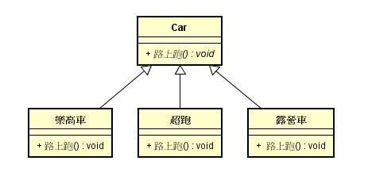
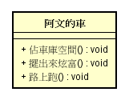

# 物件導向程式設計基本原則 - SOLID

在物件導向程式中，遵循**SOLID**這五項基本原則，可以程式設計師可以寫出好維護、易擴充的程式架構：
  
### S: Single responsibility principle(SRP) 單一職責  
一個類別只負責一件事情，阿文18歲生日後取得汽車駕照，爸爸買一台車可以在天空上飛、在路上走、在水下游泳的車給他當生日禮物，是不是很酷的事情?
可是阿文想開這台車，就必須要有機師職照、汽車駕照、潛水艇駕駛證照才能上路，這台車故障了，就需要修飛機的技師、修汽車的技師、修潛艇的技師一起維修才行。  

如果一個類別負擔太多工作，就會像上面的超級汽車一樣，不論是使用上或是維護上都會造成使用者很大的困擾。
要注意單一職責不是指一個類別裡面只有一個方法，就算是一台普通的車，也會有前進、後退、左轉、右轉等等基本功能吧!  

但是也要注意不要過度把功能切的太細碎造成過度設計的情況，例如將一台車拆程方向盤、大燈、引擎、汽缸等等零件(雖然他們都有各自的功能)，
汽車駕駛人只要知道車子怎麼開就夠了，不需要去理解車子內部詳細的構造。 
致於怎樣算是一個功能，就要視實際的需求而定，其實這是很抽象，也很難釐清的事情，這部分我們就先到這裡就好。
 
## O: Open/close principle(OCP)  開放/封閉原則 
物件導向程式設計最重要的開放(擴充)封閉(修改)原則。一套軟體應該要能擴充新的功能，但如果這些程式碼耦合度(coupling)，
新增功能時還要小心翼翼避免修改到舊的程式碼，工作上就變得很麻煩，因此舊程式碼應該是封閉修改的，
或是某個舊功能需要修改，也不應該取影響到其他功能。  
   
OCP就是開放新增功能，但是封閉修改其他不相關的功能。

## L: Liskov substitution principle(LSP)   Liskov替換  
在一個系統中，子類別應該可以被父類別替換。阿文要開車去阿嬤家，車庫裡面有很多台車，我們只看其中三台車，如下圖：    
  
阿文坐上1:1的樂高模型車後，發現這是樂高積木組成的車，沒有引擎，根本不能上路!!! 這種時候用父類別car去取代子類別樂高車就會有問題。  

## I: Interface Segregation Principle(ISP) 介面隔離
把不同功能的功能從介面中分離出來。 
阿文表示，樂高車也是車，我家的車最主要就是拿來佔車庫避免空間浪費，然後輪流擺在庭院炫富用，用圖表示如下：
  
  
這邊有一個小問題，不是全部的車都可以在路上跑，明顯違反了上一條LSP，因此我們需要將路上跑這個功能分割到其他介面：    

## D: Dependency Inversion Principle(DIP) 依賴反轉
定義：高階模組不應依賴低階模組，兩個都應該依賴在抽象概念上；抽象概念不依賴細節，而是細節依賴在抽象概念。
上面這段文字看起來很抽象，我嘗試翻譯一下，"話不能說的太死，盡量講一些概念性的東西"。  
  
阿文要在庭院要弄一個賞車派對，邀請函上面寫著"阿文誠摯邀請您來欣賞Ferrari FXX超跑"，因此這個派對就被綁死在FXX超跑上面了。
如果當天阿文爸也需要這輛超跑去載小三，阿文在派對那天就只能在朋友面前哭哭了。  
  
為了避免這種事情發生，邀請函上面最好是寫著"阿文誠摯邀請您來欣賞阿文珍藏車"，這樣一來當天他就算從倉庫拿出樂高模型車來展示也可以。
  