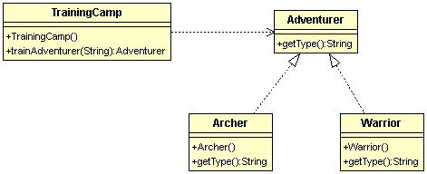

# 簡單工廠模式 SimpleFactor

####目的：定義一個簡單工廠，傳入不同的參數取得不同的類別物件 
* 簡單工廠又稱為靜態工廠模式，一般來說同一個工廠所產生的類別會有一個共同的父類別(介面)
   
###首先，先從新手村開始  
現在要設計一個訓練冒險者(Adventurer)的訓練營(TrainingCamp)，裡面可以訓練的冒險者種類有弓箭手(Archer)、鬥士(Warrior)。  
套到簡單工廠模式中，訓練營就是我們的簡單工廠(SimpleFactory)，冒險者則是產品的父類別(Product)，弓箭手與鬥士為實體產品(ConcreteProduct)。  

如果有人要來招募冒險者組隊，只要跟訓練營說請幫我訓練一個冒險者就可以，不用去理解訓練過程。
現在新手村要多訓練一種冒險者:牧師(Priest)，只要在trainAdventurer這個方法裡面增加一個switch case分支就好。  
這樣會有個問題，直接修改TrainingCamp類別的內容，違反了開放/封閉原則，因此簡單工廠不能算是一個健全的設計模式，
不過如果簡單工廠在小型的軟體架構中很好用，因此一般設計模式的教學都會從簡單工廠模式開始。

###類別圖  
  

###程式碼
產品介面與實作類別  
```
// 冒險者(Product)
public interface Adventurer {
	//告訴別人你是哪種冒險者
	String getType();
}

// 弓箭手(ConcreteProduct)
public class Archer implements Adventurer {
	@Override
	public String getType() {
		System.out.println("我是弓箭手");
		return  this.getClass().getSimpleName();
	}
}

// 鬥士(ConcreteProduct)
public class Warrior implements Adventurer {
	@Override
	public String getType() {
		System.out.println("我是鬥士");	
		return  this.getClass().getSimpleName();
	}
}	

```  

簡單工廠類別  
```  
/**
 * 冒險者訓練營(SimpleFactor)
 */
public class TrainingCamp {
	public static Adventurer trainAdventurer(String type){
		switch(type){
			case "archer" : System.out.println("訓練一個弓箭手");return new Archer(); 
			case "warrior": System.out.println("訓練一個鬥士");return new Warrior();
			// 假如冒險者種類新增，增加case就可以
			default : return null;
		}
	}
}  
```  
  
測試碼  
```
// 冒險者訓練營測試
public class VillageTest {
	@Test
	public void test(){
		//新手村訓練冒險者
		Adventurer memberA = Village.trainAdventurer("archer");
		Adventurer memberB = Village.trainAdventurer("warrior");
		//看看是不是真的訓練出我們想要的冒險者，這是Juint的東西，看不懂可以直接跳過
		Assert.assertEquals(memberA.getType(), "Archer");
		Assert.assertEquals(memberB.getType(), "Warrior");
	}
}

```

測試結果
```
==========簡單工廠模式測試==========
訓練一個弓箭手
訓練一個鬥士
我是弓箭手
我是鬥士
```

 
  
