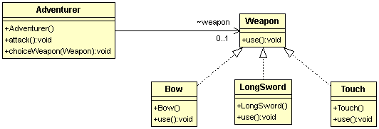

# 策略模式 Strategy Pattern
  
####目的：將各種可以互換的演算法(策略)包裝成一個類別  

###冒險者要來打怪物了
經過了新手村刻苦的訓練，冒險者終於踏出了村莊，面對不同的怪物，冒險者需要選擇不同的戰鬥策略(Strategy)來跟各種怪物戰鬥，例如說一般的小怪物就隨便砍兩刀就好，遇到強一點的怪物可能就需要放技能來造成大量的傷害，遇到刀槍不入的殭屍就用火來燒。  
    
在策略模式中，會有規範用的策略介面(Strategy)，各種實際上的戰鬥策略則是實體策略(Concrete Strategy)，使用策略的冒險者則是環境類別(Context)。  
  
  
###類別圖  
  
   
###程式碼  
策略介面與策略實作
```
/**
 * 戰鬥策略(Strategy)
 */
public interface FlightStrategy {
	/**
	 * 執行戰鬥策略
	 */
	void execute();
}

/**
 * 一般攻擊(ConcreteStrategy)
 */
public class NormalAttack implements FlightStrategy {

	@Override
	public void execute() {
		System.out.println("使用一般攻擊");		
	}
}

/**
 * 使用技能(ConcreteStrategy)
 */
public class UseSkill implements FlightStrategy {
	@Override
	public void execute() {
		System.out.println("使用超級痛的技能攻擊");		
	}
}

/**
 * 使用道具(ConcretStratey)
 */
public class UseItem implements FlightStrategy {
	@Override
	public void execute() {
		System.out.println("使用道具，丟火把");
	}
}
```

環境類別Context
```
/**
 * 冒險者(Context)
 */
public class Adventurer {
	FlightStrategy flightStrategy;  //不同戰鬥方式效果不同(strategy)
	/**
	 * 攻擊
	 */
	public void attack(){
		// 預設為普通攻擊
		if(flightStrategy == null){
			flightStrategy = new NormalAttack();
		}
		flightStrategy.execute();
	}
	
	/**
	 * 選擇不同的武器(策略)
	 */
	public void choiceStrategy(FlightStrategy strategy){
		this.flightStrategy = strategy;
	}
}
```

測試碼  
```
/**
 * 策略模式-測試
 */
public class FlightTest {
	
	@Test
	public void test(){
		Adventurer ad = new Adventurer();
		
		// 史萊姆用一般攻擊就可以
		System.out.println("出現史萊姆>");
		ad.choiceStrategy(new NormalAttack());
		ad.attack();
		System.out.println();
		
		// 利害的敵人要用厲害的招式打他
		System.out.println("非常非常巨大的史萊姆>");
		ad.choiceStrategy(new UseSkill());
		ad.attack();
		System.out.println();
				
		// 出現不怕刀槍只怕火的敵人，丟道具燒他
		System.out.println("出現不怕刀槍的殭屍>");
		ad.choiceStrategy(new UseItem());
		ad.attack();
	}
	
}
```
測試結果    
```
==========策略模式測試==========
出現史萊姆>>>
使用一般攻擊

非常非常巨大的史萊姆>>>
使用超級痛的技能攻擊

出現不怕刀槍的殭屍>>>
使用道具，丟火把

```  

